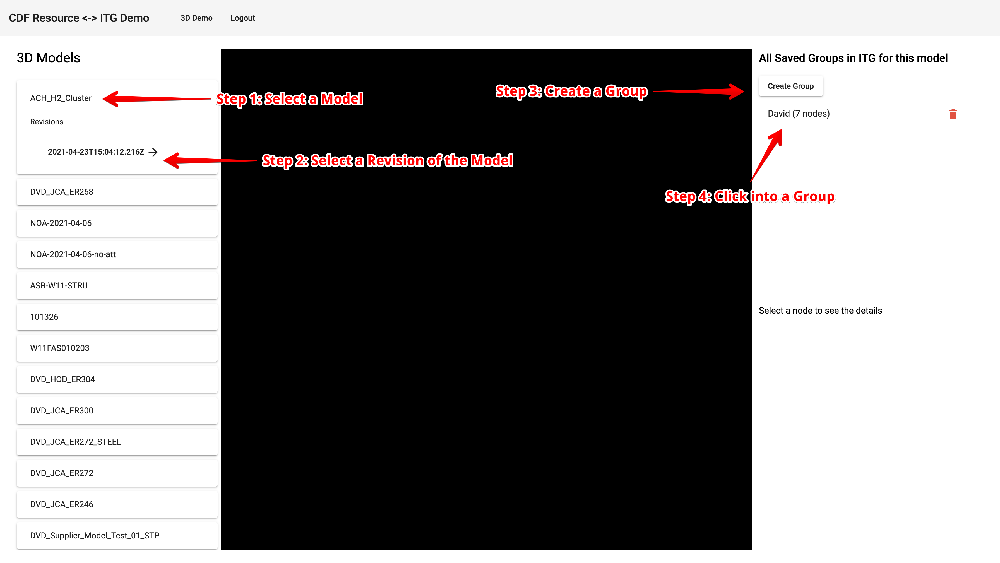

# Sample CDF Resource <-> ITG Demo App

Hello! Welcome to a sample app showing how you can use CDF Resources like 3D and ITG together. This app will allow you to define "Groups" of 3D Nodes through navigating uploaded models on CDF.

Before we start, lets outline what this sample app covers:

- Defining and deploying a data model (a.k.a schema) to ITG [link](https://itg.cognite.ai/docs/tutorials/designing-graphql-schema).
- Connecting Angular to Reveal 3D Viewer [link](https://itg.cognite.ai/docs/tutorials/designing-graphql-schema)
- Connecting Angular to Cognite's SDK to fetch 3D data [link](https://cognitedata.github.io/reveal-docs/docs)
- Connecting Angular to ITG's GraphQL endpoint (using apollo) and fetch your application data (represented by the data model in point 1). [link](https://apollo-angular.com/docs/)

Each of these points be elaborated in another section.

# Introduction (live link to demo app)

A live version of the demo is deployed here (based off of the `master` branch).

*https://cognitedata.github.io/sample-cdf-graphql-angular-app/*

Application Details/Tutorial





To use the application, you MUST use the `aize-dev` tenant. To run this application in other tenants, clone this application and set up the CLI to deploy the schema to that tenant. The next section will go over this in details.

If you have any question, please message the `#prod-cdf-epc-extension` channel on slack or email david.liu@cognite.com.

Next sections will contain 2 key sections

1. Setting this demo app
2. Demo code for your own app
   - Reveal 3D Viewer.
   - Cognite's SDK to fetch resources like 3D, files etc.
   - ITG's GraphQL endpoint to store and query application data.

# 1. Setting Up the App

## Prerequisite

Before we start, make sure:

1. You have access to a CDF tenant and have an `APIKEY`!
   This `APIKEY` must have access to 3D. For more on this go [here](https://itg.cognite.ai/docs/#from-where-can-i-get-api-key)
2. You have some 3D models uploaded and published in CDF. For more on this go [here](https://docs.cognite.com/cdf/3d/).
3. Clone this repository, run `yarn` to install all packages.

## Set up the data model for the application (and running the app locally)

All of this will be done through the CLI (command line interface), which has the full documentation [here](https://itg.cognite.ai/docs/tutorials/data-ingestion/cli/getting-started). We will also use the [GraphQL](https://graphql.org/) language to defined these data models.

We will use the CLI to publish the schema from the [`schema.graphql`](schema.graphql) data model here.

> You can also feel free to use the UI to copy and paste that file in your project, be sure to note the project ID in the URL (i.e. https://itg.cognite.ai/projects/xxx-xxx-xxx <-) this will be important later.

To start the setup of the CLI, run in command line in the home directory of this repository.

> All the `yarn itg xxx` prefix is just help you not have to install the cli globally, you can also feel free to install the CLI globally and run `itg xxx` without `yarn`

`yarn itg init --api-key=<API-KEY>`

after completion, you should have a `.itgrc` in the directory,.

> If you already have a project set up, then run `yarn itg init --api-key=<API-KEY> --project-id <ITG-PROJECT-ID>` where `<ITG-PROJECT-ID>` is the id of your project.

Next, we will set up the schema in `schema.graphql` [here](schema.graphql).

```graphql
type MyGroup {
  id: ID! @id
  name: String!
  modelId: String!
  revisionId: String!
  nodes: [MyNode!] @relation(name: "HAS_NODE", direction: OUT)
}

type MyNode {
  group: MyGroup! @relation(name: "HAS_NODE", direction: IN)
  nodeId: String! @id
  comment: String
}
```

It is a very simple data model where we have `MyGroup` which has many `MyNode`s, which holds references to CDF resources. The `@id` "decorator" makes sure that the `MyGroup.id` and `MyNode.nodeId` is unique. The `!` makes sure that those fields are required, and fields like `MyNode.comment` would be nullable. You can learn more about this data modeling language [here](https://graphql.org/learn/).

Now that we understand the data model, we can update the project with this data model via the CLI.

`yarn itg schema update --api-key=<API-KEY> -f schema.graphql`

From then on, go to `src/app/graphql.modules.ts` and update the URL on line 12 to have the correct Project ID from earlier step.

Now you can run the app locally via `yarn start` and use the `APIKEY` to log in and use the app.

# 2. Sample code for your application

To see how to use ITG to setup data model, this is covered in the earlier section. The next few sections will talk about using the Reveal 3D Viewer, Cognite SDK and ITG GraphQL toolkits.

## 2.1 Connecting Angular to Reveal 3D Viewer

Cognite's Reveal viewer is an industry leading web viewer that can render any of the 3D files uploaded to your tenant. Please take a look at the documentation here for various features available via Reveal in their [docs](https://cognitedata.github.io/reveal-docs/docs).

For Angular, the set up is quite easy, check out the [Sample Files](./src/app/components/cognite-threed-viewer).

There are 3 files:

- `.html` file which simply has a `<div id="viewer"></div>`. We will use this div to load in the 3D model.
- `.css` file which simply makes the `#viewer` height and width 100%.
- `.ts` [file](src/app/components/cognite-threed-viewer/cognite-threed-viewer.component.ts) which has the bulk of the logic.

Lets dig more into the `.ts` [file](src/app/components/cognite-threed-viewer/cognite-threed-viewer.component.ts), which has the bulk of the logic.

**Setting up viewer**

The [`ngOnInit`](src/app/components/cognite-threed-viewer/cognite-threed-viewer.component.ts#57) function shows you how to initialize a viewer.

`ngOnInit` calls the [`_addModelToViewer`](src/app/components/cognite-threed-viewer/cognite-threed-viewer.component.ts#109) function to load in the model into the viewer.

The Reveal documentation also goes through this in detail [here](https://cognitedata.github.io/reveal-docs/docs/examples/cad-basic)

**Setting up on click handler**

In the `ngOnInit`, it also sets up a click handler to the [`_onClick`](src/app/components/cognite-threed-viewer/cognite-threed-viewer.component.ts#128) function.

Note that the viewer talks in `treeIndex` but the best way to reference a node is via the `nodeId`.

**Setting custom visuals (highlighting clicks, ghosting nodes, etc.)**

The [`_highlightNodes`](src/app/components/cognite-threed-viewer/cognite-threed-viewer.component.ts#152) shows how you can color, ghost, outline nodes using `NodeSet`. There's much more details on the Reveal documentation here [here](https://cognitedata.github.io/reveal-docs/docs/examples/cad-highlighting)

## 2.2 Connecting Angular to Cognite's SDK

Using the Cognite SDK is very easy, there's a step by step documentation [here](https://docs.cognite.com/dev/guides/sdk/js/#quickstart). For a simplicity, we kept the 2 key aspect of using Cognite's SDK in 2 seperate file:

### Authorization - [cognite-auth.service.ts](src/app/cognite-auth.service.ts)

This is a simple demo of how you can login to CDF via the SDK through an API key. You can also authenticate using other ways through the SDK, such as OIDC, old tenancy flow. You can find more details on the well documented Cognite docs [here](https://docs.cognite.com/dev/guides/sdk/js/).

We will share the sdk via the `getSDK` function, so that for the rest of the app (viewer, and the loading resource service in the next section) can use the same instance of the SDK.

### Loading Resources - [cognite-api.service.ts](src/app/cognite-api.service.ts)

This is a simple service showing how to load values from the SDK and make them observables for the RxJS workflow.

Through the SDK, you can access all of the CDF resources, not just 3D. This is much better documented in the Cognite docs as well, available [here](https://github.com/cognitedata/cognite-sdk-js/blob/master/packages/stable/README.md).

# 2.3 Connecting Angular to ITG's GraphQL endpoint

We use [`Apollo`](https://apollo-angular.com/docs/) to connect to Cognite's GraphQL endpoint. This endpoint enables the data from your data model defined in section 1 to be accessed. As well you can add/modify data in your data model, as long as it conforms to the access control of the project, as described [here](https://itg.cognite.ai/docs/tutorials/access-control).

There are 2 key files:

### Apollo GraphQL Setup - [graphql.module.ts](src/app/graphql.module.ts)

This file instantiate a Apollo service with the authorization header that has the Cognite API key to access.

It first declares on [line 12](src/app/graphql.module.ts#12) the URL to access the project data.

Then, on [line 21](src/app/graphql.module.ts#21), it provides the authorization parameter (header) to validate access to your data.

Now we have set up the Apollo service, which provides a RxJS way to access data with caching benefits. An example on how to use it is in the next section

### Using the Apollo Service to grab data - [itg-api.service.ts](src/app/itg-api.service.ts)

This file provides some sample code in fetching data from the endpoint. At the top of the file are the `gql` queries that accepts parameters in `$xxx` variables.

Simple functions like `getGroups` shows how to query, and `createGroup` shows how to run a mutation.

To compose more complex, chained mutation + query are something like

- [`createNodeIfNotExists`](src/app/itg-api.service.ts#139) shows where you would first create (if not exist) a node reference
- [`addNodeToGroup`](src/app/itg-api.service.ts#125) first `createNodeIfNotExists`, then add the node reference to a group.
